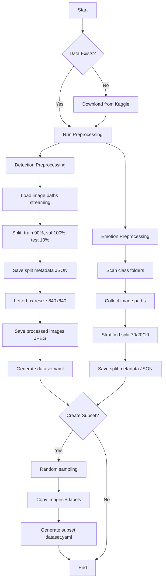

# Visual Dog Emotion Recognition - Complete Project Documentation

This repository contains a complete solution for visual dog emotion recognition using a two-stage deep learning pipeline:
1. **Dog face detection** using YOLOv8
2. **Emotion classification** using ResNet50

This document combines information from multiple sources to provide comprehensive documentation for the project.

---

## Table of Contents
1. [Project Overview](#1-project-overview)
2. [Directory Structure](#2-directory-structure)
3. [Module Descriptions](#3-module-descriptions)
4. [Dataset Sources](#4-dataset-sources)
5. [Data Processing Workflow](#5-data-processing-workflow)
6. [Quick Start Guide](#6-quick-start-guide)
7. [Data Flow](#7-data-flow)
8. [Experiment Workflow](#8-experiment-workflow)
9. [Output Organization](#9-output-organization)
10. [Key Design Principles](#10-key-design-principles)

---

## 1. Project Overview

This project implements a **two-stage deep learning pipeline** for visual dog emotion recognition:
- **Stage 1**: Dog face detection using YOLOv8
- **Stage 2**: Emotion classification using ResNet50

### Core Architecture
```
Input Image/Video
       ↓
┌─────────────────────┐
│  Dog Face Detection  │ ← YOLOv8 (configurable variants)
│  (Bounding Box)      │
└─────────────────────┘
       ↓ (crop face)
┌─────────────────────┐
│ Emotion Classification│ ← ResNet50 (configurable variants)
│  (5 emotions)        │
└─────────────────────┘
       ↓
Output: BBox + Emotion Label
```

### Technical Stack
- **Framework**: PyTorch 2.0+ with torchvision
- **Hardware**: AWS SageMaker JupyterLab with NVIDIA T4 GPU (16GB VRAM)
- **Detection Model**: YOLOv8 (single base model with configurable parameters)
- **Classification Model**: ResNet50 (single base model with configurable parameters)
- **Datasets**: 
  - Dog Face Detection Dataset (~6,000 images)
  - Dog Emotion Dataset (~9,000 images, 5 classes)

---

## 2. Directory Structure

```
CNN_A3/
│
├── README.md                          # Project overview and usage guide
├── requirements.txt                   # Python dependencies
├── config.yaml                        # Global configuration (paths, defaults)
├── PartC-Project Structure.md         # This file
│
├── data/                              # Data directory (auto-created)
│   ├── raw/                           # Original downloaded datasets
│   │   ├── detection_dataset/         # Dog Face Detection (Kaggle)
│   │   └── emotion_dataset/           # Dog Emotion (Kaggle)
│   │
│   └── processed/                     # Preprocessed & split datasets
│       ├── detection/                 # Detection splits
│       │   ├── train/
│       │   │   ├── img_00000.jpg
│       │   │   └── labels/
│       │   │       └── img_00000.txt
│       │   ├── valid/
│       │   │   ├── img_XXXXX.jpg
│       │   │   └── labels/
│       │   │       └── img_XXXXX.txt
│       │   ├── test/
│       │   │   ├── img_XXXXX.jpg
│       │   │   └── labels/
│       │   │       └── img_XXXXX.txt
│       │   └── dataset.yaml           # YOLOv8 config
│       └── detection_small/            # Optional subset for testing
│           └── (same structure as above)
│       └── emotion/                   # Emotion splits
│           ├── train_split.json
│           ├── val_split.json
│           ├── test_split.json
│           └── metadata.json
│
├── src/                               # Source code package
│   ├── __init__.py
│   │
│   ├── data_processing/               # Data download & preprocessing
│   │   ├── __init__.py
│   │   ├── download_datasets.py       # Download datasets (run once)
│   │   ├── detection_preprocessor.py  # Detection data preprocessing
│   │   ├── emotion_preprocessor.py    # Emotion data preprocessing
│   │   ├── create_detection_subset.py # Create small subset for testing
│   │   ├── augmentation.py            # Data augmentation utilities
│   │   └── dataset_utils.py           # Common utilities
│   │
│   ├── models/                        # Model definitions (SIMPLIFIED)
│   │   ├── __init__.py
│   │   ├── detection_model.py         # ONE model: YOLOv8Detector
│   │   │   └── class YOLOv8Detector   # Configurable via parameters
│   │   │
│   │   └── classification_model.py    # ONE model: ResNet50Classifier
│   │       └── class ResNet50Classifier # Configurable via parameters
│   │
│   ├── training/                      # Training frameworks
│   │   ├── __init__.py
│   │   ├── detection_trainer.py       # Detection training logic
│   │   │   ├── class DetectionTrainer
│   │   │   ├── init_model()
│   │   │   ├── train_epoch()
│   │   │   ├── validate()
│   │   │   └── optimize()
│   │   │
│   │   └── classification_trainer.py  # Classification training logic
│   │       ├── class ClassificationTrainer
│   │       ├── init_model()
│   │       ├── train_epoch()
│   │       ├── validate()
│   │       └── optimize()
│   │
│   ├── evaluation/                    # Evaluation frameworks
│   │   ├── __init__.py
│   │   ├── detection_evaluator.py     # Detection metrics (mAP, IoU)
│   │   │   ├── calculate_mAP()
│   │   │   ├── calculate_IoU()
│   │   │   ├── plot_precision_recall()
│   │   │   └── generate_evaluation_report()
│   │   │
│   │   └── classification_evaluator.py # Classification metrics
│   │       ├── calculate_metrics()
│   │       ├── plot_confusion_matrix()
│   │       ├── plot_roc_curve()
│   │       └── generate_evaluation_report()
│   │
│   ├── inference/                     # Inference pipeline
│   │   ├── __init__.py
│   │   ├── detection_inference.py     # Detection-only inference
│   │   ├── classification_inference.py # Classification-only inference
│   │   └── pipeline_inference.py      # End-to-end stacked inference
│   │       ├── detect_and_classify()
│   │       └── visualize_results()
│   │
│   └── utils/                         # Utility functions
│       ├── __init__.py
│       ├── logger.py                  # Logging setup
│       ├── visualization.py           # Plotting utilities
│       ├── metrics.py                 # Metric calculations
│       └── file_utils.py              # File I/O helpers
│
├── experiments/                       # 6 Experiment scripts
│   ├── __init__.py
│   ├── exp01_detection_baseline.py        # YOLOv8 baseline
│   ├── exp02_detection_modified_v1.py     # YOLOv8 modified v1
│   ├── exp03_detection_modified_v2.py     # YOLOv8 modified v2
│   ├── exp04_classification_baseline.py   # ResNet50 baseline
│   ├── exp05_classification_modified_v1.py # ResNet50 modified v1
│   ├── exp06_classification_modified_v2.py # ResNet50 modified v2
│   │
│   └── experiment_template.py         # Template for new experiments
│
├── outputs/                           # Experiment outputs (SIMPLIFIED)
│   ├── exp01_detection_baseline/      # Experiment 1 folder
│   │   ├── run_20260420_193045/       # Run 1 (timestamped)
│   │   │   ├── model/
│   │   │   │   ├── best_model.pt
│   │   │   │   └── model_config.json
│   │   │   ├── logs/
│   │   │   │   ├── training_log.csv
│   │   │   │   └── experiment_report.md
│   │   │   └── figures/
│   │   │       ├── precision_recall_curve.png
│   │   │       ├── IoU_distribution.png
│   │   │       └── sample_detections.png
│   │   │
│   │   └── run_20260421_101523/       # Run 2 (new timestamp)
│   │       └── ... (same structure)
│   │
│   ├── exp02_detection_modified_v1/   # Experiment 2 folder
│   │   └── run_TIMESTAMP/
│   │       ├── model/
│   │       ├── logs/
│   │       └── figures/
│   │
│   ├── exp03_detection_modified_v2/   # Experiment 3 folder
│   │   └── run_TIMESTAMP/
│   │       └── ...
│   │
│   ├── exp04_classification_baseline/ # Experiment 4 folder
│   │   └── run_TIMESTAMP/
│   │       └── ...
│   │
│   ├── exp05_classification_modified_v1/ # Experiment 5 folder
│   │   └── run_TIMESTAMP/
│   │       └── ...
│   │
│   └── exp06_classification_modified_v2/ # Experiment 6 folder
│       └── run_TIMESTAMP/
│           └── ...
│
├── notebooks/                         # Jupyter notebooks
│   ├── 01_data_exploration.ipynb
│   ├── 02_model_comparison.ipynb
│   └── 03_inference_demo.ipynb
│
└── scripts/                           # Convenience scripts
    ├── download_data.sh               # Download datasets
    ├── run_all_experiments.sh         # Run all 6 experiments
    ├── run_single_experiment.sh       # Run specific experiment
    └── inference_demo.sh              # Demo inference
```

---

## 3. Module Descriptions

### 3.1 Data Processing (`src/data_processing/`)

#### Purpose
Handle dataset download, preprocessing, and splitting into train/valid/test sets.

#### Key Features
- **One-time download**: Checks if data exists before downloading
- **Unified output format**: Both datasets converted to appropriate formats
- **Persistent storage**: Processed data saved for reuse
- **Different preprocessing pipelines**:
  - Detection: Handles bounding box annotations, converts to YOLO format, applies letterbox resize
  - Emotion: Handles folder-based classes, creates train/val/test splits (no preprocessing)

#### Files
- `download_datasets.py`: Downloads both datasets from Kaggle
- `detection_preprocessor.py`: Preprocesses detection dataset
- `emotion_preprocessor.py`: Preprocesses emotion dataset
- `create_detection_subset.py`: Creates small subsets for testing
- `augmentation.py`: Data augmentation transforms
- `dataset_utils.py`: Common utilities (normalization, loading)

### 3.2 Model Definitions (`src/models/`)

#### **Simplified Design Philosophy**
Each task uses **ONE base model class** with **configurable parameters** to create different variants across experiments.

#### Detection Model: `detection_model.py`
```python
class YOLOv8Detector:
    """
    Single YOLOv8 wrapper with configurable parameters.
    
    Configuration options:
    - backbone_depth: 'n', 's', 'm', 'l', 'x' (model size)
    - input_size: 640, 1280, etc.
    - confidence_threshold: 0.3, 0.5, 0.7
    - nms_iou_threshold: 0.45, 0.5, 0.6
    - anchor_settings: custom anchor boxes
    """
    def __init__(self, config: dict):
        self.config = config
        # Initialize YOLOv8 with specified parameters
```

**Experiments using this model:**
- Exp01: Baseline (default params: backbone='m', input_size=640, conf=0.5)
- Exp02: Modified v1 (different params: backbone='l', input_size=1280, conf=0.6)
- Exp03: Modified v2 (different params: backbone='s', custom anchors, conf=0.4)

#### Classification Model: `classification_model.py`
```python
class ResNet50Classifier:
    """
    Single ResNet50 wrapper with configurable parameters.
    
    Configuration options:
    - dropout_rate: 0.3, 0.5, 0.7
    - additional_fc_layers: True/False
    - freeze_strategy: 'all', 'partial', 'none'
    - num_classes: 5 (fixed for this task)
    - use_batch_norm: True/False
    """
    def __init__(self, config: dict):
        self.config = config
        # Initialize ResNet50 with specified parameters
```

**Experiments using this model:**
- Exp04: Baseline (default params: dropout=0.5, freeze='partial')
- Exp05: Modified v1 (different params: dropout=0.7, additional layers)
- Exp06: Modified v2 (different params: dropout=0.3, no freeze)

---

## 4. Dataset Sources

### Detection Dataset

**Source**: Kaggle dataset `jessicali9530/dog-face-detection`

**Raw Structure**:
```
data/raw/detection_dataset/
├── train_img/          # 5,924 training images (.jpg)
├── train_label/        # 5,924 YOLO format labels (.txt)
├── val_img/            # 230 validation images (.jpg)
└── val_label/          # 230 YOLO format labels (.txt)
```

**Label Format** (YOLO):
```
class_id x_center y_center width height
```
- All coordinates normalized to [0, 1]
- Each `.txt` file may contain multiple bounding boxes (multi-dog images)
- Single class: dog_face (class_id = 0)

### Emotion Dataset

**Source**: Kaggle dataset `tongpython/dog-emotions-5-classes`

**Raw Structure**:
```
data/raw/emotion_dataset/
├── alert/      # 1,865 images
├── angry/      # 1,865 images
├── frown/      # 1,865 images
├── happy/      # 1,865 images
└── relax/      # 1,865 images
```

**Classes**: 5 emotion categories
- Total: ~9,325 images
- Balanced distribution across classes

---

## 5. Data Processing Workflow

### System Architecture

The data processing system consists of three main components:

1. **Detection Preprocessor** ([`src/data_processing/detection_preprocessor.py`](src/data_processing/detection_preprocessor.py))
   - Processes dog face detection dataset
   - Applies letterbox resize to preserve aspect ratio
   - Converts to YOLOv8 format

2. **Emotion Preprocessor** ([`src/data_processing/emotion_preprocessor.py`](src/data_processing/emotion_preprocessor.py))
   - Organizes emotion classification dataset
   - Creates stratified train/val/test splits
   - No image preprocessing (images loaded on-the-fly)

3. **Subset Creator** ([`src/data_processing/create_detection_subset.py`](src/data_processing/create_detection_subset.py))
   - Creates small subsets from processed detection data
   - Used for quick testing and debugging
   - Maintains data integrity (image-label pairs)

### Processing Philosophy

- **Detection**: Heavy preprocessing with disk-based storage to handle large images efficiently
- **Emotion**: Minimal preprocessing, path-based references for flexibility
- **Memory Management**: Streaming approach to avoid OOM errors with large datasets
- **Reproducibility**: All splits use fixed random seeds (random_state=42)

### Detection Dataset Processing

#### Processing Pipeline

#### Step 1: Load All Data (Streaming Mode)

**Method**: `_load_all_data_streaming()`

**Process**:
1. Sequentially loads train and val splits to minimize memory usage
2. Reads image paths (not pixel data) to save memory
3. Parses YOLO format labels into structured lists
4. Returns: `(image_paths, annotations)` tuples

**Memory Optimization**:
- Only stores file paths in memory (~KB per image)
- Clears train data before loading val data
- Uses `gc.collect()` after each split

**Code Flow**:
```python
# Load train split
train_images, train_annotations = _load_split_data_generator('train')
all_images.extend(train_images)
all_annotations.extend(train_annotations)
del train_images, train_annotations  # Free memory
gc.collect()

# Load val split
val_images, val_annotations = _load_split_data_generator('val')
all_images.extend(val_images)
all_annotations.extend(val_annotations)
```

#### Step 2: Split Dataset (Respecting Original Structure)

**Strategy**: Option A - Preserve original val, split train into train/test

**Rationale**:
- Original dataset already has professional train/val split
- Preserves this split to maintain data quality
- Creates test set from training data only

**Split Ratios**:
- **Train**: 90% of original train_img (~5,332 images)
- **Valid**: 100% of original val_img (230 images, kept as-is)
- **Test**: 10% of original train_img (~592 images)

**Implementation**:
```python
from sklearn.model_selection import train_test_split

# Use original val as validation (no splitting)
X_val = val_images
y_val = val_annotations

# Split original train into train (90%) and test (10%)
X_train, X_test, y_train, y_test = train_test_split(
    train_images, 
    train_annotations, 
    test_size=0.10, 
    random_state=42
)
```

#### Step 3: Save Split Metadata

**Location**: `data/splitting/detection_split/`

**Files Created**:
1. `train_split.json` - Original paths of training images
2. `val_split.json` - Original paths of validation images
3. `test_split.json` - Original paths of test images
4. `metadata.json` - Overall dataset statistics

**Purpose**:
- Records which original images belong to each split
- Useful for auditing and reproducibility
- Does NOT contain processed image data (only paths)

**Metadata Example**:
```json
{
  "dataset_type": "detection",
  "total_samples": 6154,
  "split_strategy": "Option A: Preserve original val, split train into train/test",
  "splits": {
    "train": {"count": 5332, "source": "train_img (90%)"},
    "val": {"count": 230, "source": "val_img (100%, kept as-is)"},
    "test": {"count": 592, "source": "train_img (10%)"}
  },
  "format": "YOLO",
  "preprocessing": "letterbox_resize",
  "target_size": 640
}
```

#### Step 4-6: Process and Save Each Split

**Method**: `_preprocess_and_save_split()`

**Processing Steps**:

##### 4.1 Letterbox Resize

**Purpose**: Preserve aspect ratio while resizing to 640x640

**Algorithm**:
```python
def _letterbox_resize(img, bboxes, target_size=640):
    h, w = img.shape[:2]
    
    # Calculate scale ratio (keep aspect ratio)
    scale = min(target_size / w, target_size / h)
    
    # Resize
    new_w, new_h = int(w * scale), int(h * scale)
    img_resized = cv2.resize(img, (new_w, new_h))
    
    # Calculate padding
    pad_w = (target_size - new_w) / 2
    pad_h = (target_size - new_h) / 2
    
    # Add padding (gray color: RGB 114, 114, 114)
    img_padded = cv2.copyMakeBorder(
        img_resized, top, bottom, left, right,
        cv2.BORDER_CONSTANT, value=[114, 114, 114]
    )
    
    # Adjust bounding boxes
    adjusted_bboxes = []
    for bbox in bboxes:
        class_id, x_c, y_c, bw, bh = bbox
        
        # Scale coordinates
        x_c_new = x_c * scale
        y_c_new = y_c * scale
        bw_new = bw * scale
        bh_new = bh * scale
        
        # Add padding offset and normalize
        x_c_final = (x_c_new + pad_w) / target_size
        y_c_final = (y_c_new + pad_h) / target_size
        bw_final = bw_new / target_size
        bh_final = bh_new / target_size
        
        adjusted_bboxes.append([class_id, x_c_final, y_c_final, bw_final, bh_final])
    
    return img_padded, adjusted_bboxes
```

**Key Points**:
- Padding color: Gray (114, 114, 114) - standard for YOLO
- Bounding box coordinates adjusted for both scaling AND padding
- Final coordinates normalized to [0, 1] relative to 640x640

##### 4.2 Batch Processing

**Batch Size**: 100 images per batch

**Rationale**:
- Each 640x640x3 float32 image ≈ 4.7 MB
- Batch of 100 ≈ 470 MB (safe for most systems)
- Balances speed vs memory usage

**Process**:
```python
batch_size = 100
n_batches = (n_images + batch_size - 1) // batch_size

for batch_idx in range(n_batches):
    start_idx = batch_idx * batch_size
    end_idx = min(start_idx + batch_size, n_images)
    
    for i in range(start_idx, end_idx):
        # Process single image
        img = cv2.imread(image_path)
        img_processed, bboxes_processed = _letterbox_resize(img, bboxes)
        
        # Save to disk immediately
        cv2.imwrite(output_path, img_processed)
        save_annotations(label_path, bboxes_processed)
        
        # Clear memory
        del img, img_processed, bboxes_processed
        gc.collect()
    
    # Clear batch memory
    gc.collect()
```

##### 4.3 File Naming Convention

**Images**: `img_XXXXX.jpg` (zero-padded 5-digit index)
- Train: `img_00000.jpg` to `img_05331.jpg`
- Valid: `img_05332.jpg` to `img_05561.jpg`
- Test: `img_05562.jpg` to `img_06153.jpg`

**Labels**: `img_XXXXX.txt` (matching image names)

**Example Label File** (`img_00000.txt`):
```
0 0.523456 0.412345 0.156789 0.234567
0 0.234567 0.678901 0.098765 0.123456
```

##### 4.4 Error Handling

**Damaged Files**:
- Skips unreadable images silently
- Logs failed images to `failed_{split}_images.txt`
- Continues processing remaining images

**Warning Suppression**:
- Redirects OpenCV C++ warnings to `/dev/null`
- Keeps console output clean
- Only shows application-level messages

#### Step 7: Generate YOLOv8 Configuration

**File**: `data/processed/detection/dataset.yaml`

**Content**:
```yaml
path: data/processed/detection  # Relative path from project root
train: train                     # Relative to path
val: valid                       # Relative to path
test: test                       # Relative to path

nc: 1                            # Number of classes
names: ['dog_face']              # Class names
```

**Usage**:
```python
from ultralytics import YOLO

model = YOLO('yolov8m.pt')
model.train(data='data/processed/detection/dataset.yaml', epochs=50)
```

### Emotion Dataset Processing

#### Processing Philosophy

**Minimal Preprocessing Approach**:
- NO image resizing or normalization during preprocessing
- Images remain in original format and size
- Only creates split indices (JSON files)
- Actual image loading happens during training (on-the-fly)

**Benefits**:
- Faster preprocessing (seconds vs hours)
- Flexible image transformations at training time
- Lower disk space requirements
- Easy to experiment with different augmentations

#### Processing Pipeline

#### Step 1: Load and Organize Data

**Method**: `_load_raw_data()`

**Process**:
1. Iterates through 5 emotion class folders
2. Collects all image paths (supports .jpg, .jpeg, .png)
3. Assigns class labels based on folder name
4. Returns: `(image_paths, labels)` lists

**Class Mapping**:
```python
classes = ["angry", "happy", "relax", "frown", "alert"]
class_to_idx = {cls: idx for idx, cls in enumerate(classes)}
# {'angry': 0, 'happy': 1, 'relax': 2, 'frown': 3, 'alert': 4}
```

**Note**: Folder name is `relax` (not `relaxed`) - must match config exactly.

#### Step 2: Stratified Splitting

**Method**: `_split_dataset()`

**Split Ratios**:
- Train: 70%
- Valid: 20%
- Test: 10%

**Stratification**:
- Maintains class distribution across all splits
- Ensures each split has proportional representation of all 5 emotions
- Uses `sklearn.model_selection.train_test_split` with `stratify` parameter

**Two-Stage Splitting**:
```python
from sklearn.model_selection import train_test_split

# Stage 1: Separate test set (10%)
X_temp, X_test, y_temp, y_test = train_test_split(
    images, labels, test_size=0.10, random_state=42, stratify=labels
)

# Stage 2: Split remaining into train (70%) and val (20%)
val_adjusted = 0.20 / (0.70 + 0.20)  # = 0.222...
X_train, X_val, y_train, y_val = train_test_split(
    X_temp, y_temp, test_size=val_adjusted, random_state=42, stratify=y_temp
)
```

**Result Distribution** (approximate):
- Train: ~6,527 images
- Valid: ~1,865 images
- Test: ~933 images

Each split maintains ~20% per class (balanced dataset).

#### Step 3: Save Split Metadata

**Location**: `data/splitting/emotion_split/`

**Files Created**:
1. `train_split.json`
2. `val_split.json`
3. `test_split.json`
4. `metadata.json`

**Split JSON Format**:
```json
{
  "images": [
    "/path/to/data/raw/emotion_dataset/happy/img_001.jpg",
    "/path/to/data/raw/emotion_dataset/angry/img_042.jpg",
    ...
  ],
  "labels": [
    "happy",
    "angry",
    ...
  ]
}
```

**Metadata JSON**:
```json
{
  "dataset_type": "emotion_classification",
  "classes": ["angry", "happy", "relax", "frown", "alert"],
  "class_to_idx": {"angry": 0, "happy": 1, "relax": 2, "frown": 3, "alert": 4},
  "total_samples": 9325,
  "splits": {
    "train": 6527,
    "val": 1865,
    "test": 933
  },
  "class_distribution": {
    "train": {"angry": 1305, "happy": 1306, ...},
    "val": {"angry": 373, "happy": 373, ...},
    "test": {"angry": 187, "happy": 186, ...}
  },
  "format": "folder_based",
  "preprocessing": "none"
}
```

### Training-Time Loading

During training, images are loaded dynamically:

```python
from torch.utils.data import Dataset
from PIL import Image

class EmotionDataset(Dataset):
    def __init__(self, split_json_path, transform=None):
        with open(split_json_path) as f:
            data = json.load(f)
        self.image_paths = data['images']
        self.labels = data['labels']
        self.transform = transform
    
    def __getitem__(self, idx):
        img = Image.open(self.image_paths[idx]).convert('RGB')
        label = self.class_to_idx[self.labels[idx]]
        
        if self.transform:
            img = self.transform(img)
        
        return img, label
```

### Subset Creation for Testing

#### Purpose

Create small subsets from processed detection dataset for:
- Quick pipeline validation (minutes vs hours)
- Debugging data loading issues
- Testing model architecture changes
- Local CPU development before GPU deployment

#### Implementation

**Script**: `src/data_processing/create_detection_subset.py`

**Features**:
1. Random sampling from each split
2. Preserves image-label pairing
3. Maintains YOLOv8 directory structure
4. Auto-generates `dataset.yaml` for subset
5. Tracks creation metadata

#### Usage

##### Method 1: Via Shell Script (Recommended)

```bash
# After preprocessing, create default subset (50/10/10)
bash scripts/run_data_preprocessing.sh --create-subset

# Custom sample counts
bash scripts/run_data_preprocessing.sh \
    --create-subset \
    --train-samples 30 \
    --val-samples 5 \
    --test-samples 5
```

##### Method 2: Direct Python Execution

```bash
python src/data_processing/create_detection_subset.py \
    --input_dir data/processed/detection \
    --output_dir data/processed/detection_small \
    --train_samples 100 \
    --val_samples 20 \
    --test_samples 20
```

#### Algorithm

```python
def _process_split(split_name, target_count):
    # Get all available images
    image_files = sorted(input_split_dir.glob('*.jpg'))
    
    # Random selection
    actual_count = min(target_count, len(image_files))
    selected_images = random.sample(image_files, actual_count)
    
    # Copy images and corresponding labels
    for img_path in selected_images:
        shutil.copy2(img_path, output_split_dir / img_path.name)
        
        label_path = input_labels_dir / f"{img_path.stem}.txt"
        if label_path.exists():
            shutil.copy2(label_path, output_labels_dir / label_path.name)
```

#### Output Structure

```
data/processed/detection_small/
├── train/
│   ├── img_00123.jpg          # 50 randomly selected images
│   ├── img_00456.jpg
│   └── labels/
│       ├── img_00123.txt      # Matching labels
│       └── img_00456.txt
├── valid/
│   ├── img_05400.jpg          # 10 images
│   └── labels/
│       └── img_05400.txt
├── test/
│   ├── img_05600.jpg          # 10 images
│   └── labels/
│       └── img_05600.txt
├── dataset.yaml               # Points to subset paths
└── subset_metadata.json       # Creation info
```

#### Integration with Experiments

Use subset by pointing to its `dataset.yaml`:

```python
# In experiment script
trainer = DetectionTrainer(
    config_path='config.yaml',
    dataset_yaml='data/processed/detection_small/dataset.yaml'  # Use subset
)
trainer.train(epochs=5)  # Fewer epochs for testing
```

### Execution Flow

#### Complete Workflow



#### Command-Line Execution

##### Full Pipeline

```bash
# Standard preprocessing (no subset)
bash scripts/run_data_preprocessing.sh

# Preprocessing + subset creation
bash scripts/run_data_preprocessing.sh --create-subset
```

##### Individual Components

```bash
# Only detection preprocessing
python src/data_processing/detection_preprocessor.py

# Only emotion preprocessing
python src/data_processing/emotion_preprocessor.py

# Only subset creation (after preprocessing)
python src/data_processing/create_detection_subset.py
```

#### Execution Time Estimates

| Task | Approximate Time | Notes |
|------|-----------------|-------|
| Download detection dataset | 10-30 min | Depends on internet speed |
| Download emotion dataset | 5-15 min | Smaller dataset |
| Detection preprocessing | 15-45 min | Letterbox resize is compute-intensive |
| Emotion preprocessing | < 1 min | Only creates JSON files |
| Subset creation | < 30 sec | File copying only |
| **Total (first run)** | **30-90 min** | Mostly download time |
| **Subsequent runs** | **15-45 min** | Skip downloads |

### Configuration

#### Global Config ([`config.yaml`](config.yaml))

```yaml
paths:
  data_root: "data"
  raw_data: "data/raw"
  processed_data: "data/processed"
  outputs: "outputs"

datasets:
  detection:
    name: "dog_face_detection"
    kaggle_dataset: "jessicali9530/dog-face-detection"
    image_size: 640              # Target size for letterbox resize
    train_ratio: 0.7
    val_ratio: 0.2
    test_ratio: 0.1
    
  emotion:
    name: "dog_emotion"
    kaggle_dataset: "tongpython/dog-emotions-5-classes"
    image_size: 224              # Not used in preprocessing
    classes: ["angry", "happy", "relax", "frown", "alert"]
    train_ratio: 0.7
    val_ratio: 0.2
    test_ratio: 0.1
```

#### Key Parameters

##### Detection Preprocessing

| Parameter | Value | Description |
|-----------|-------|-------------|
| `image_size` | 640 | Target dimension for letterbox resize |
| `padding_color` | [114, 114, 114] | Gray padding (YOLO standard) |
| `batch_size` | 100 | Images processed per batch |
| `random_seed` | 42 | For reproducible splits |
| `test_split_ratio` | 0.10 | 10% of train_img becomes test set |

##### Emotion Preprocessing

| Parameter | Value | Description |
|-----------|-------|-------------|
| `train_ratio` | 0.70 | 70% for training |
| `val_ratio` | 0.20 | 20% for validation |
| `test_ratio` | 0.10 | 10% for testing |
| `random_seed` | 42 | For reproducible stratified splits |
| `classes` | 5 | Must match folder names exactly |

##### Subset Creation

| Parameter | Default | Description |
|-----------|---------|-------------|
| `--train_samples` | 50 | Training samples in subset |
| `--val_samples` | 10 | Validation samples in subset |
| `--test_samples` | 10 | Test samples in subset |
| `--input_dir` | `data/processed/detection` | Source dataset |
| `--output_dir` | `data/processed/detection_small` | Output location |

### Output Formats

#### Detection Dataset Outputs

##### Processed Images

**Format**: JPEG (quality ~95, default OpenCV)
**Size**: 640x640 pixels (with padding)
**Color Space**: BGR (OpenCV default)
**Naming**: Sequential `img_XXXXX.jpg`

##### Annotations

**Format**: YOLO text format
**Encoding**: UTF-8
**Structure**: One line per bounding box
```
class_id x_center y_center width height
```

**Example** (`img_00000.txt`):
```
0 0.523456 0.412345 0.156789 0.234567
0 0.234567 0.678901 0.098765 0.123456
```

---

## 6. Quick Start Guide

### 🚀 Quick Overview

This project implements a two-stage pipeline:
1. **Dog Detection** (YOLOv8) - Find dogs in images
2. **Emotion Classification** (ResNet50) - Classify emotions: Angry, Happy, Relaxed, Frown, Alert

### 📋 Prerequisites

- Python 3.9 - 3.11 (⚠️ **Python 3.12+ not supported yet**)
- Git
- Datasets already downloaded and extracted to `data/raw/` directory

### 🔧 Installation

#### Option A: CPU Setup (Local Testing) ✅ Recommended for First-Time Users

Perfect for validating code logic before GPU training.

##### Step 1: Create Virtual Environment

```bash
cd CNN_A3
python3 -m venv .venv
source .venv/bin/activate  # On Windows: .venv\Scripts\activate
```

##### Step 2: Install PyTorch (CPU Version)

```bash
pip install torch torchvision --index-url https://download.pytorch.org/whl/cpu
```

##### Step 3: Install Other Dependencies

```bash
pip install -r requirements.txt
```

##### Step 4: Fix NumPy Compatibility

Some packages may upgrade NumPy to 2.x, which is incompatible. Force downgrade:

```bash
pip install 'numpy>=1.24.0,<2.0.0' --force-reinstall
```

✅ **Verify Installation:**
```bash
python test_setup.py
```

Expected output: `🎉 ALL TESTS PASSED!`

#### Option B: GPU Setup (AWS SageMaker) 🚀 For Production Training

Use this for full-scale model training with NVIDIA T4 GPU (16GB VRAM).

##### Step 1: Activate Conda Environment (SageMaker Default)

```bash
conda activate pytorch_p310
```

##### Step 2: Install Dependencies

```bash
cd CNN_A3
pip install -r requirements.txt
```

✅ **Verify GPU Availability:**
```python
import torch
print(f"CUDA Available: {torch.cuda.is_available()}")
print(f"GPU Device: {torch.cuda.get_device_name(0) if torch.cuda.is_available() else 'None'}")
```

Expected output: `CUDA Available: True`

### 📊 Dataset Setup

#### ⚠️ Important: Simplified Data Workflow

This project uses a **minimal data preparation workflow**:
1. **Manual Download**: You must download and extract datasets to `data/raw/` before running any experiments
2. **Lightweight Parsing**: Run the parsing script to organize data paths and create train/val/test splits
3. **No Preprocessing**: Images are NOT resized, normalized, or augmented - they're loaded on-the-fly during training

**Key Benefits:**
- ✅ No memory issues (images not loaded into RAM)
- ✅ Fast setup (seconds instead of minutes)
- ✅ Flexible (preprocessing happens in training pipeline with augmentations)

### Dataset Structure

Your `data/raw/` directory should contain:

```
data/raw/
├── detection_dataset/          # Dog face detection dataset
│   ├── train_img/             # Training images (~5924 .jpg files)
│   ├── train_label/           # Training labels (YOLO format .txt files)
│   ├── val_img/               # Validation images (~230 .jpg files)
│   └── val_label/             # Validation labels (YOLO format .txt files)
│
└── emotion_dataset/            # Dog emotion classification dataset
    ├── alert/                 # ~1865 images
    ├── angry/                 # ~1865 images
    ├── frown/                 # ~1865 images
    ├── happy/                 # ~1865 images
    └── relax/                 # ~1865 images
```

### Step 1: Verify Raw Data Exists

Make sure you have downloaded and extracted both datasets:
- **Detection Dataset**: Dog Face Detection from Kaggle
- **Emotion Dataset**: Dog Emotions (5 classes) from Kaggle

Place them in the correct directories as shown above.

### Step 2: Run Data Parsing and Splitting

Once raw data is in place, run the parsing script:

```bash
bash scripts/run_data_preprocessing.sh
```

This will:
1. Parse YOLO-format annotations (for detection dataset)
2. Organize image paths by class (for emotion dataset)
3. Split data into train/valid/test sets (70/20/10)
4. Save lightweight JSON metadata to `data/processed/`

**Expected output:**
```
==========================================
Running Data Preprocessing
==========================================

[1/2] Parsing Detection Dataset...
================================================================================
DETECTION DATASET PARSING AND SPLITTING
================================================================================

[1/4] Loading training data...
  Loaded 5924 training images

[2/4] Loading validation data...
  Loaded 230 validation images

[3/4] Combining and splitting dataset (70/20/10)...

[4/4] Saving split metadata...
  Saved train split: 4307 images
  Saved val split: 1231 images
  Saved test split: 616 images
  Saved metadata

PARSING AND SPLITTING COMPLETE
Total samples: 6154
  Train: 4307 images
  Valid: 1231 images
  Test: 616 images

Note: Images are NOT preprocessed. They will be loaded during training.

[2/2] Parsing Emotion Dataset...
================================================================================
EMOTION DATASET PARSING AND SPLITTING
================================================================================

[1/3] Loading and organizing dataset...
  Loaded 9325 images across 5 classes

  Class distribution:
    alert: 1865
    angry: 1865
    frown: 1865
    happy: 1865
    relax: 1865

[2/3] Splitting dataset (70/20/10)...

[3/3] Saving split metadata...
  Saved train split: 6527 images
  Saved val split: 1865 images
  Saved test split: 933 images
  Saved metadata

PARSING AND SPLITTING COMPLETE
Total samples: 9325
  Train: 6527 images
  Valid: 1865 images
  Test: 933 images

Note: Images are NOT preprocessed. They will be loaded during training.

==========================================
Data parsing complete!
==========================================
```

### Step 3: Verify Parsed Data

After parsing, verify that data is ready:

```bash
python src/data_processing/processed_datasets_verify.py
```

You should see:
```
✓ ALL DATASETS READY
Detection dataset: data/processed/detection
Emotion dataset: data/processed/emotion
```

**Note:** Parsing only needs to be done **once**. All experiments will reuse the split metadata.

### 🧪 Test Your Setup

#### Quick Logic Validation (CPU)

Before training, verify all components work:

```bash
source .venv/bin/activate  # If using venv
python test_setup.py
```

This tests:
- ✅ Module imports
- ✅ Model creation & forward pass
- ✅ Data loading utilities
- ✅ Output directory structure

### 🎯 Run Your First Experiment

#### Start with Classification Baseline (Simplest)

```bash
python experiments/exp04_classification_baseline.py
```

**What happens:**
1. Verifies processed datasets exist
2. Loads preprocessed emotion data
3. Trains ResNet50 model
4. Evaluates on test set
5. Saves results to `outputs/exp04_classification_baseline/run_TIMESTAMP/`

**Expected runtime:**
- CPU: ~30-60 minutes (small dataset, few epochs)
- GPU: ~5-10 minutes

### 📂 Understanding Outputs

After running an experiment:

```
outputs/exp04_classification_baseline/run_20260420_201500/
├── model/
│   ├── best_model.pth          ← Best model weights
│   └── model_config.json       ← Configuration used
├── logs/
│   ├── training_log.csv        ← Epoch-by-epoch metrics
│   ├── experiment_report.md    ← Human-readable summary
│   └── evaluation_metrics.json ← Test set performance
└── figures/                    ← Visualizations
    ├── confusion_matrix.png
    ├── training_curves.png
    └── ...
```

**View Results:**
```bash
# Read the report
cat outputs/exp04_classification_baseline/run_*/logs/experiment_report.md

# Check metrics
cat outputs/exp04_classification_baseline/run_*/logs/evaluation_metrics.json
```

### 🔄 All Experiments

#### Detection Experiments (YOLOv8)

```bash
python experiments/exp01_detection_baseline.py      # Baseline YOLOv8
python experiments/exp02_detection_modified_v1.py   # Modified v1
python experiments/exp03_detection_modified_v2.py   # Modified v2
```

#### Classification Experiments (ResNet50)

```bash
python experiments/exp04_classification_baseline.py      # Baseline ResNet50
python experiments/exp05_classification_modified_v1.py   # Modified v1
python experiments/exp06_classification_modified_v2.py   # Modified v2
```

### Run All Experiments

```bash
bash scripts/run_all_experiments.sh
```

### 🔍 Inference Demo

Test trained models on your own images:

```bash
bash scripts/inference_demo.sh path/to/your/image.jpg
```

### ⚙️ Configuration

#### Modify Hyperparameters

Edit any experiment script to change settings:

```python
training_config = {
    'learning_rate': 0.001,
    'batch_size': 16,           # Reduce if OOM
    'epochs': 30,
    'use_amp': True,            # Enable mixed precision (GPU only)
    'gradient_accumulation_steps': 1,
}
```

### Global Settings

Edit [`config.yaml`](config.yaml) for project-wide defaults.

### 🐛 Troubleshooting

#### Issue: "No module named 'torch'"

**Solution:**
```bash
pip install torch torchvision --index-url https://download.pytorch.org/whl/cpu
pip install -r requirements.txt
```

#### Issue: "NumPy compatibility error" or "_ARRAY_API not found"

**Cause:** Some packages upgraded NumPy to 2.x

**Solution:**
```bash
pip install 'numpy>=1.24.0,<2.0.0' --force-reinstall
```

#### Issue: "Datasets not ready. Please run preprocessing first."

**Cause:** You haven't run the preprocessing script yet, or processed data is missing.

**Solution:**
```bash
# Step 1: Verify raw data exists
ls data/raw/detection_dataset/
ls data/raw/emotion_dataset/

# Step 2: Run preprocessing
bash scripts/run_data_preprocessing.sh

# Step 3: Verify processed data
python src/data_processing/processed_datasets_verify.py
```

#### Issue: "Out of Memory" (GPU)

**Solution:** Reduce batch size and enable optimizations:

```python
training_config = {
    'batch_size': 8,                  # Reduce from 32
    'gradient_accumulation_steps': 2, # Simulate larger batch
    'use_amp': True,                  # Enable mixed precision
    'freeze_backbone': True,          # Freeze ResNet backbone initially
}
```

#### Issue: "CUDA not available"

**Check:**
```python
import torch
print(torch.cuda.is_available())  # Should be True on GPU
```

**Note:** Code automatically falls back to CPU if CUDA unavailable, but training will be slower.

#### Issue: Slow training on CPU

**Normal!** CPU is 10-20x slower than GPU. Use CPU only for:
- Code validation
- Small-scale testing
- Debugging

For production training, use AWS SageMaker GPU.

### 💡 Pro Tips

#### 1. Test Locally First (CPU)
```bash
# Quick validation with minimal epochs
# Edit experiment script:
training_config['epochs'] = 2  # Just verify it works
python experiments/exp04_classification_baseline.py
```

#### 2. Monitor GPU Usage (SageMaker)
```bash
nvidia-smi  # Real-time GPU monitoring
```

#### 3. Compare Experiments
```bash
# List all runs
ls outputs/exp04_classification_baseline/

# Compare reports
diff outputs/exp04_classification_baseline/run_001/logs/experiment_report.md \
     outputs/exp04_classification_baseline/run_002/logs/experiment_report.md
```

#### 4. Resume Interrupted Training
Best model is auto-saved. Check:
```bash
ls outputs/*/run_*/model/best_model.pth
```

#### 5. Clean Up Old Runs
```bash
# Remove old experiment runs (keep latest)
find outputs/ -type d -name "run_*" | sort | head -n -1 | xargs rm -rf
```

### 🆘 Still Stuck?

1. Check error messages carefully
2. Verify all dependencies: `pip list`
3. Review experiment script that failed
4. Check [`test_setup.py`](test_setup.py) passes
5. Ensure data preprocessing completed: `python src/data_processing/processed_datasets_verify.py`

### ✅ Checklist Before GPU Training

- [ ] Local CPU tests pass (`python test_setup.py`)
- [ ] Raw datasets downloaded to `data/raw/`
- [ ] Data preprocessing completed (`bash scripts/run_data_preprocessing.sh`)
- [ ] Processed data verified (`python src/data_processing/processed_datasets_verify.py`)
- [ ] At least one experiment completed successfully on CPU
- [ ] GPU environment ready (AWS SageMaker)
- [ ] Sufficient storage space (datasets ~2-3GB)

---

## 7. Data Flow

### 7.1 Data Preparation Phase
```
┌─────────────────────────────────────┐
│  1. Download Datasets (Once)        │
│     - detection_dataset/            │
│     - emotion_dataset/              │
└─────────────────────────────────────┘
              ↓
┌─────────────────────────────────────┐
│  2. Preprocess & Split              │
│     - Detection:                    │
│       * Parse annotations           │
│       * Augment (Mosaic, Flip)      │
│       * Split: 70/20/10             │
│       * Save as .jpg/.txt files     │
│                                     │
│     - Emotion:                      │
│       * Load from folders           │
│       * Create split metadata       │
│       * Split: 70/20/10             │
│       * Save as JSON metadata       │
└─────────────────────────────────────┘
              ↓
┌─────────────────────────────────────┐
│  3. Processed Data Ready            │
│     data/processed/detection/       │
│     data/processed/emotion/         │
│     (Reusable for all experiments)  │
└─────────────────────────────────────┘
```

### 7.2 Training Phase (Per Experiment)
```
┌─────────────────────────────────────┐
│  1. Load Preprocessed Data          │
│     (Skip if already processed)     │
└─────────────────────────────────────┘
              ↓
┌─────────────────────────────────────┐
│  2. Initialize Model                │
│     - Load base model class         │
│     - Apply experiment config       │
│     - Transfer learning weights     │
└─────────────────────────────────────┘
              ↓
┌─────────────────────────────────────┐
│  3. Configure Training              │
│     - Optimizer (SGD/Adam/AdamW)    │
│     - Loss function                 │
│     - Hyperparameters               │
│     - Scheduler                     │
└─────────────────────────────────────┘
              ↓
┌─────────────────────────────────────┐
│  4. Train Model                     │
│     - Forward pass                  │
│     - Backward pass                 │
│     - Optimization step             │
│     - Validation every N epochs     │
│     - Early stopping check          │
│     - Progress bars (tqdm)          │
└─────────────────────────────────────┘
              ↓
┌─────────────────────────────────────┐
│  5. Evaluate on Test Set            │
│     - Calculate metrics             │
│     - Generate plots                │
│     - Create report                 │
└─────────────────────────────────────┘
              ↓
┌─────────────────────────────────────┐
│  6. Save Outputs                    │
│     - Model weights                 │
│     - Training logs                 │
│     - Figures                       │
│     - Markdown report               │
└─────────────────────────────────────┘
```

---

## 8. Experiment Workflow

### 8.1 Six Experiments Overview

| Experiment | Task | Model | Variant | Key Differences |
|------------|------|-------|---------|-----------------|
| **Exp01** | Detection | YOLOv8 | Baseline | Default params (backbone='m', size=640) |
| **Exp02** | Detection | YOLOv8 | Modified v1 | Larger model (backbone='l', size=1280) |
| **Exp03** | Detection | YOLOv8 | Modified v2 | Smaller model + custom anchors |
| **Exp04** | Classification | ResNet50 | Baseline | Default params (dropout=0.5, partial freeze) |
| **Exp05** | Classification | ResNet50 | Modified v1 | Higher dropout + additional FC layers |
| **Exp06** | Classification | ResNet50 | Modified v2 | Lower dropout + no freeze |

### 8.2 Example Experiment Script Structure

```python
# experiments/exp01_detection_baseline.py

import sys
sys.path.append('..')

from src.data_processing.download_datasets import download_datasets
from src.data_processing.detection_preprocessor import DetectionPreprocessor
from src.models.detection_model import YOLOv8Detector
from src.training.detection_trainer import DetectionTrainer
from src.evaluation.detection_evaluator import DetectionEvaluator
from src.utils.logger import setup_logger
from datetime import datetime
import os

def main():
    # 1. Setup logging
    logger = setup_logger('exp01_detection_baseline')
    
    # 2. Check/download data
    download_datasets()
    
    # 3. Preprocess (skip if exists)
    preprocessor = DetectionPreprocessor()
    if not preprocessor.is_processed():
        preprocessor.process()
    
    # 4. Load data
    train_data = preprocessor.load_split('train')
    val_data = preprocessor.load_split('valid')
    test_data = preprocessor.load_split('test')
    
    # 5. Define model config (BASELINE)
    model_config = {
        'backbone': 'm',
        'input_size': 640,
        'confidence_threshold': 0.5,
        'nms_iou_threshold': 0.45
    }
    
    # 6. Define training config
    training_config = {
        'learning_rate': 1e-3,
        'batch_size': 16,
        'epochs': 50,
        'optimizer': 'adam',
        'weight_decay': 1e-4,
        'early_stopping_patience': 10,
        'use_amp': True,
        'gradient_accumulation_steps': 1
    }
    
    # 7. Initialize model
    model = YOLOv8Detector(model_config)
    
    # 8. Initialize trainer
    trainer = DetectionTrainer(model_config, training_config)
    
    # 9. Create output directory (timestamped)
    timestamp = datetime.now().strftime('%Y%m%d_%H%M%S')
    output_dir = f'outputs/exp01_detection_baseline/run_{timestamp}'
    os.makedirs(output_dir, exist_ok=True)
    
    # 10. Train
    logger.info("Starting training...")
    trainer.train(train_data, val_data, output_dir)
    
    # 11. Evaluate
    logger.info("Starting evaluation...")
    evaluator = DetectionEvaluator()
    evaluator.evaluate(model, test_data, output_dir)
    
    # 12. Generate report
    evaluator.generate_report(output_dir)
    
    logger.info(f"Experiment completed. Results saved to: {output_dir}")

if __name__ == '__main__':
    main()
```

### 8.3 Running Experiments

#### Option 1: Run Single Experiment
```bash
cd experiments
python exp01_detection_baseline.py
```

#### Option 2: Run All Experiments Sequentially
```bash
bash scripts/run_all_experiments.sh
```

#### Option 3: Run with Custom Parameters
```bash
python exp01_detection_baseline.py --lr 0.001 --batch_size 32 --epochs 100
```

---

## 9. Output Organization

### 9.1 Simplified Output Structure

Each experiment has its own folder. Each run creates a timestamped sub-folder containing all outputs.

```
outputs/
├── exp01_detection_baseline/
│   ├── run_20260420_193045/       ← First run
│   │   ├── model/
│   │   │   ├── best_model.pt      ← Best model weights
│   │   │   └── model_config.json  ← Model configuration used
│   │   │
│   │   ├── logs/
│   │   │   ├── training_log.csv   ← Epoch-by-epoch metrics
│   │   │   └── experiment_report.md ← Full markdown report
│   │   │
│   │   └── figures/
│   │       ├── precision_recall_curve.png
│   │       ├── IoU_distribution.png
│   │       └── sample_detections.png
│   │
│   └── run_20260421_101523/       ← Second run (new timestamp)
│       └── ... (same structure)
│
├── exp02_detection_modified_v1/
│   └── run_TIMESTAMP/
│       ├── model/
│       ├── logs/
│       └── figures/
│
... (exp03-exp06 follow same pattern)
```

### 9.2 Output Contents

#### Model Folder
- `best_model.pt` / `best_model.pth`: Trained model weights
- `model_config.json`: JSON file with all hyperparameters used

#### Logs Folder
- `training_log.csv`: CSV with columns:
  ```
  epoch, train_loss, val_loss, train_metric, val_metric, learning_rate
  1, 2.345, 2.123, 0.45, 0.48, 0.001
  2, 1.987, 1.876, 0.52, 0.55, 0.001
  ...
  ```
- `experiment_report.md`: Comprehensive markdown report including:
  - Experiment configuration
  - Training summary
  - Evaluation metrics
  - Figure references
  - Hardware info
  - Execution time

#### Figures Folder
- **Detection experiments**:
  - `precision_recall_curve.png`: PR curve for each class
  - `IoU_distribution.png`: Histogram of IoU values
  - `sample_detections.png`: Example predictions on test images
  - `confusion_matrix.png`: If multi-class detection
  
- **Classification experiments**:
  - `confusion_matrix.png`: 5×5 confusion matrix
  - `roc_curve.png`: ROC curves (one-vs-rest for each class)
  - `per_class_metrics.png`: Bar chart of precision/recall/F1 per class
  - `training_curves.png`: Loss and accuracy over epochs

### 9.3 Example Experiment Report (Markdown)

```markdown
# Experiment Report: exp01_detection_baseline

## Experiment Information
- **Date**: 2026-04-20 19:30:45
- **Duration**: 2h 15m 32s
- **GPU**: NVIDIA T4 (16GB)
- **PyTorch Version**: 2.0.1

## Model Configuration
```json
{
  "backbone": "m",
  "input_size": 640,
  "confidence_threshold": 0.5,
  "nms_iou_threshold": 0.45
}
```

## Training Configuration
- **Optimizer**: Adam
- **Learning Rate**: 0.001
- **Batch Size**: 16
- **Epochs**: 50
- **Early Stopping Patience**: 10
- **Mixed Precision**: Enabled
- **Gradient Accumulation**: 1 step

## Training Summary
- **Total Epochs Completed**: 42 (early stopped at epoch 42)
- **Best Validation mAP@0.5**: 0.78 (epoch 38)
- **Final Training Loss**: 1.234
- **Final Validation Loss**: 1.456

## Evaluation Metrics (Test Set)
- **mAP@0.5**: 0.76
- **mAP@0.5:0.95**: 0.54
- **Average IoU**: 0.68
- **Precision**: 0.82
- **Recall**: 0.74

## Figures
- 
- 
- 

## Observations
- Model converged quickly in first 20 epochs
- Early stopping triggered at epoch 42
- Best performance at epoch 38
- Some false positives on small/occluded faces

## Recommendations
- Try larger input size (1280) for better small object detection
- Increase training data augmentation for occluded faces
- Consider adjusting confidence threshold to 0.6 for fewer false positives
```

---

## 10. Key Design Principles

### 10.1 Simplicity
- **One model class per task**: YOLOv8Detector and ResNet50Classifier
- **Configuration-driven variants**: Different experiments use same class with different configs
- **Simplified output structure**: Only 6 top-level folders, timestamped runs

### 10.2 Reusability
- **Data preprocessing once**: Processed data reused across all experiments
- **Modular design**: Separate modules for data, models, training, evaluation
- **Template-based experiments**: Easy to create new experiments from template

### 10.3 Reproducibility
- **Timestamped runs**: Each execution creates unique output folder
- **Config logging**: All hyperparameters saved to JSON
- **Comprehensive reports**: Markdown reports with all details
- **Version control friendly**: Clear separation of code and outputs

### 10.4 Scalability
- **Easy to add experiments**: Copy template, modify config
- **Easy to compare runs**: Same experiment, different timestamps
- **Extensible architecture**: Add new models by creating new wrapper classes

### 10.5 Performance Optimization
- **Mixed precision training**: AMP for memory efficiency
- **Gradient accumulation**: Simulate larger batch sizes

---

## 📚 Additional Documentation

For more detailed information on specific aspects of the project:
- **Data Processing**: See the detailed workflow above in Section 5
- **Project Structure**: See the complete architecture in Section 2
- **Quick Start**: Follow the installation and setup guide in Section 6

---

## 🐕✨ Happy Training!

This project provides a complete pipeline for visual dog emotion recognition. The combination of YOLOv8 for detection and ResNet50 for emotion classification enables accurate identification of dog emotions in various scenarios. 

Follow the quick start guide to get up and running, and experiment with different model configurations to improve performance!